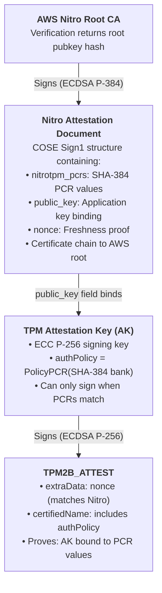

# AWS Nitro TPM Attestation

This document describes how TPM attestation works on AWS Nitro Enclaves and EC2 instances with NitroTPM.

## Overview

AWS Nitro provides two attestation mechanisms that work together:

1. **Nitro Security Module (NSM)** - Hardware-based attestation signed by AWS
2. **NitroTPM** - A vTPM with PCR values signed in the Nitro document

By combining these, we get a chain of trust from AWS hardware to arbitrary application data.

## Chain of Trust



## Why SHA-384 PCRs?

The Nitro document signs `nitrotpm_pcrs` which contains **SHA-384** PCR values. For a coherent chain of trust:

- The AK's `authPolicy` references the SHA-384 PCR bank
- Verification computes policy from SHA-384 PCRs
- The signed Nitro PCRs match what the AK is bound to

This ensures a single, verifiable path from AWS hardware to the attested data.

## Attestation Flow

### Generation (on Nitro instance)

```rust
// 1. Detect Nitro and choose PCR bank
let is_nitro = tpm.is_nitro_tpm()?;
let pcr_alg = if is_nitro { TpmAlg::Sha384 } else { TpmAlg::Sha256 };

// 2. Read PCR values from chosen bank
let pcr_values = tpm.read_pcrs(pcr_alg)?;

// 3. Compute PCR policy digest
let auth_policy = Tpm::calculate_pcr_policy_digest(&pcr_values, pcr_alg)?;

// 4. Create AK bound to this policy
let ak = tpm.create_primary_ecc_key_with_policy(TPM_RH_OWNER, &auth_policy)?;

// 5. AK self-certifies (proves it exists with this policy)
let certify_result = tpm.certify(ak.handle, ak.handle, &nonce)?;

// 6. Get Nitro attestation binding the AK public key
let nitro_doc = tpm.nsm_attest(
    None,                           // user_data
    Some(nonce.to_vec()),          // nonce (same as TPM)
    Some(ak_public_key_secg),      // public_key (binds AK)
)?;
```

### Verification (anywhere)

```rust
// 1. Parse attestation output
let output: AttestationOutput = serde_json::from_str(&json)?;

// 2. Verify Nitro document (COSE signature, cert chain)
let nitro_result = verify_nitro_attestation(&nitro_doc)?;

// 3. Verify AK public key matches Nitro's public_key binding
assert!(ak_pubkey == nitro_result.document.public_key);

// 4. Verify TPM signature over TPM2B_ATTEST
verify_ecdsa_p256(&attest_data, &signature, &ak_pubkey)?;

// 5. Compute expected AK name from PCR policy
let policy = calculate_pcr_policy(&sha384_pcrs, TpmAlg::Sha384)?;
let expected_name = compute_ecc_p256_name(&ak_x, &ak_y, &policy);

// 6. Verify certified name matches (proves PCR binding)
assert!(attest_info.certified_name == expected_name);

// 7. Verify nonces match (proves freshness and binding)
assert!(tpm_nonce == nitro_nonce);

// 8. Verify PCR values match signed Nitro document
assert!(output.pcrs["sha384"] == nitro_result.document.pcrs);
```

## Security Properties

### What This Proves

1. **Hardware Root of Trust** - The Nitro document is signed by AWS hardware (certificate chain to AWS root CA)

2. **PCR Integrity** - The SHA-384 PCR values in the attestation match what AWS hardware measured

3. **Key Binding** - The AK is bound to specific PCR values via `authPolicy` (it cannot sign unless PCRs match)

4. **Freshness** - The nonce in both TPM and Nitro attestations proves the attestation is fresh

5. **AK Authenticity** - The Nitro document's `public_key` field proves the AK belongs to this Nitro instance

### What This Does NOT Prove

1. **EK Certificate** - We don't verify EK certificates in the Nitro path (unnecessary - Nitro document provides stronger binding)

2. **PCR Meaning** - The attestation proves PCR *values*, not what they *mean*. You need to understand what software produces which PCR measurements.

3. **Enclave vs Instance** - This works for both Nitro Enclaves and regular EC2 with NitroTPM. The PCR values differ based on what's running.

## Nitro Document Structure

The Nitro attestation document is a COSE Sign1 structure:

```
COSE_Sign1 = [
    protected: { alg: ES384 },
    unprotected: {},
    payload: {
        module_id: "i-xxx-tpm00000000000000",
        digest: "SHA384",
        timestamp: 1234567890,
        nitrotpm_pcrs: {
            0: <48 bytes>,
            1: <48 bytes>,
            ...
        },
        certificate: <DER certificate>,
        cabundle: [<intermediate certs>],
        public_key: <65 bytes, SECG uncompressed>,
        user_data: <optional>,
        nonce: <optional>,
    },
    signature: <96 bytes, ECDSA P-384>
]
```

## PCR Values on NitroTPM

| PCR | Description |
|-----|-------------|
| 0 | Firmware/BIOS measurements |
| 1 | Platform configuration |
| 2-3 | Option ROMs |
| 4 | Boot loader |
| 5 | Boot loader configuration |
| 6 | Resume events |
| 7 | Secure Boot state |
| 8-9 | Kernel and initrd |
| 10 | IMA (Integrity Measurement Architecture) |
| 11-16 | Application-defined |
| 17-22 | Reserved (0xFF...) |
| 23 | Application-defined |

## Example Output

```json
{
  "pcrs": {
    "sha384": {
      "0": "6e901b16932f6e036747d7a57696e4a2...",
      "1": "7e10323dec25050c22d2e91709373c93...",
      ...
    }
  },
  "signing_key_public_keys": {
    "ecc_p256": {
      "x": "3678325466f129d8279056737fe48378...",
      "y": "9384bc5fafdc7938f9a51e09490a5555..."
    }
  },
  "attestation": {
    "tpm": {
      "ecc_p256": {
        "nonce": "31373639393231303439",
        "attest_data": "ff544347801700...",
        "signature": "304402207c8fb54ca1603b3a..."
      }
    },
    "nitro": {
      "public_key": "043678325466f129d827...",
      "nonce": "31373639393231303439",
      "document": "8444a1013822a059..."
    }
  }
}
```

Note: Only SHA-384 PCRs are included because that's the bank bound to the AK and signed in the Nitro document.

## References

- [AWS Nitro Enclaves Attestation](https://docs.aws.amazon.com/enclaves/latest/user/verify-root.html)
- [NitroTPM Documentation](https://docs.aws.amazon.com/AWSEC2/latest/UserGuide/nitrotpm.html)
- [TPM 2.0 Library Specification](https://trustedcomputinggroup.org/resource/tpm-library-specification/)
- [COSE (RFC 8152)](https://datatracker.ietf.org/doc/html/rfc8152)
