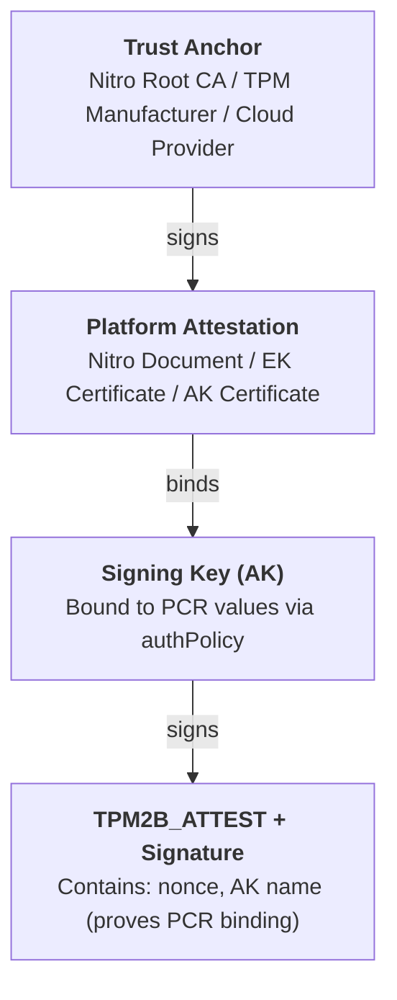

# vaportpm-attest

Cloud vTPM attestation in pure Rust with **zero C dependencies**.

> Physical TPM trust is vapor. Cloud vTPM is where the real trust lives.

---

Most people wrap the crusty C-based `tss2` monolith. Instead, this library implements the bare minimum TPM 2.0 wire-protocol, yeeting bytes directly to `/dev/tpm0`:

- No libtss2, or any C toolchain
- Direct protocol command/response serialization
- Minimal, and focused on cloud attestation
- Comprehensive `selftest` binary

## Features

### PCR Operations (`PcrOps` trait)

- Read PCR values from all active banks (SHA-1, SHA-256, SHA-384, SHA-512)
- Extend PCRs with automatic multi-bank support
- Query which banks a PCR is allocated in
- Read all allocated PCRs from the TPM

### Key Management

- Create primary ECC P-256 signing keys
- Sign data with TPM keys (ECDSA signatures)
- Create PCR-sealed keys (policy-based authorization)

### NV RAM Operations (`NvOps` trait)

- **Read Operations:**
  - Read from TPM Non-Volatile storage
  - Read NV index public information
  - Enumerate all NV indices
  - Read Endorsement Key (EK) certificates
- **Write Operations:**
  - Define new NV spaces with attributes
  - Write data to NV indices
  - Undefine (delete) NV spaces
  - Find free NV indices

### Attestation

- Certify keys using other keys
- Generate attestation structures
- PCR policy digest calculation

### AWS Nitro Security Module (NSM) Support (`NsmOps` trait)

- Request attestation documents from AWS Nitro Secure Module
- Includes PCR values, optional user data, nonce, and public key
- Automatic detection of Nitro TPM via vendor string

### TPM Vendor Detection

- Query TPM manufacturer and vendor information
- Check if running on AWS Nitro TPM (`is_nitro_tpm()`)

## Quick Start

### Basic TPM Operations

```rust
use vaportpm_attest::{Tpm, PcrOps, TPM_RH_OWNER};

fn main() -> anyhow::Result<()> {
    // Open the TPM
    let mut tpm = Tpm::open()?;

    // Read PCR 0 from all banks
    let pcrs = tpm.pcr_read_all_banks(&[0])?;
    for (index, alg, value) in pcrs {
        println!("PCR {} [{}]: {:02x?}", index, alg.name(), value);
    }

    // Extend PCR 23 with data (extends all allocated banks automatically)
    tpm.pcr_extend(23, b"measurement data")?;

    // Create a signing key
    let key = tpm.create_primary_ecc_key(TPM_RH_OWNER)?;
    println!("Key handle: 0x{:08X}", key.handle);

    // Sign some data
    let digest = sha256(b"Hello, TPM!");
    let signature = tpm.sign(key.handle, &digest)?;

    // Clean up
    tpm.flush_context(key.handle)?;

    Ok(())
}
```

### NV RAM Operations

```rust
use vaportpm_attest::{Tpm, NvOps, TPM_ALG_SHA256};
use vaportpm_attest::nv::{NV_INDEX_USER_START, NV_INDEX_USER_END};
use vaportpm_attest::nv::{TPMA_NV_AUTHWRITE, TPMA_NV_AUTHREAD};

fn main() -> anyhow::Result<()> {
    let mut tpm = Tpm::open()?;

    // Find a free NV index
    let nv_index = tpm.nv_find_free_index(NV_INDEX_USER_START, NV_INDEX_USER_END)?;

    // Define a new NV space (1024 bytes)
    let attrs = TPMA_NV_AUTHWRITE | TPMA_NV_AUTHREAD;
    tpm.nv_define_space(nv_index, 1024, attrs, TPM_ALG_SHA256)?;

    // Write data
    tpm.nv_write(nv_index, b"Hello from NV RAM!")?;

    // Read it back
    let data = tpm.nv_read(nv_index)?;
    println!("Read: {:?}", String::from_utf8_lossy(&data));

    // Clean up
    tpm.nv_undefine_space(nv_index)?;

    Ok(())
}
```

### AWS Nitro TPM Support

```rust
use vaportpm_attest::{Tpm, NsmOps};

fn main() -> anyhow::Result<()> {
    let mut tpm = Tpm::open()?;

    // Check if this is a Nitro TPM
    if tpm.is_nitro_tpm()? {
        println!("Running on AWS Nitro TPM!");

        // Get NSM attestation document (requires /dev/tpm0)
        let mut tpm_direct = Tpm::open_direct()?;
        let doc = tpm_direct.nsm_attest(
            Some(b"user data".to_vec()),
            Some(b"nonce".to_vec()),
            None // Optional: public key
        )?;

        println!("Attestation document: {} bytes", doc.len());
    }

    Ok(())
}
```

## Running Tests

### `selftest` - Comprehensive TPM Test Suite

The "self test" binary exercises all major functionality:

```bash
cargo run --bin selftest
```

It performs:
1. Query TPM properties (manufacturer, firmware version, etc.)
2. Detect AWS Nitro TPM
3. Query active PCR banks
4. Read all non-zero PCR values
5. Extend PCR 23 and verify the change
6. Create a primary ECC signing key
7. Sign test data
8. Access the Endorsement Key
9. Read EK certificates from NV RAM
10. Enumerate all NV indices
11. Create PCR-sealed keys
12. Certify keys (attestation)

### `nsmtest` - AWS Nitro Security Module Test

Test NSM attestation functionality (requires AWS Nitro TPM):

```bash
cargo run --bin nsmtest
```

This requests an attestation document from the Nitro Secure Module and displays the result.

## Requirements

- Linux with TPM 2.0 support
- `/dev/tpmrm0` accessible (TPM Resource Manager) - for most operations
- `/dev/tpm0` accessible (Direct TPM access) - for NSM vendor commands
- Rust

**Note:** Most operations use `/dev/tpmrm0` (TPM Resource Manager), which handles context management automatically. AWS Nitro NSM vendor commands require direct access via `/dev/tpm0` and should use `Tpm::open_direct()`.

## Technical Details

### Protocol Implementation

The library implements the TPM 2.0 command/response protocol as specified in the [TPM 2.0 Library Specification](https://trustedcomputinggroup.org/resource/tpm-library-specification/):

- Big-endian serialization for all multi-byte values
- TPM2B (size-prefixed buffer) structures
- Command headers with proper sizing
- Response parsing with error handling
- Session-based authorization (password sessions)

### Supported Commands

**Standard TPM 2.0 Commands:**
- `TPM2_PCR_Read` - Read PCR values
- `TPM2_PCR_Extend` - Extend PCRs with measurements
- `TPM2_GetCapability` - Query TPM capabilities and properties
- `TPM2_CreatePrimary` - Create primary keys
- `TPM2_Sign` - Sign data with TPM keys
- `TPM2_FlushContext` - Release handles
- `TPM2_NV_Read` - Read NV storage
- `TPM2_NV_ReadPublic` - Get NV index info
- `TPM2_NV_DefineSpace` - Create NV indices
- `TPM2_NV_Write` - Write to NV storage
- `TPM2_NV_UndefineSpace` - Delete NV indices
- `TPM2_PolicyPCR` - PCR policy operations
- `TPM2_Certify` - Key certification/attestation

**Vendor-Specific Commands:**
- `TPM2_CC_VENDOR_AWS_NSM_REQUEST` (0x20000001) - AWS Nitro Security Module attestation

### Extension Traits

The library uses extension traits to organize functionality:

- **`PcrOps`** - PCR read/extend operations
- **`NvOps`** - NV RAM read/write operations
- **`NsmOps`** - AWS Nitro Security Module operations
- **`EkOps`** - Endorsement Key operations (create standard EK, signing keys)

Import the traits you need:
```rust
use vaportpm_attest::{Tpm, PcrOps, NvOps, NsmOps, EkOps};
```

### Hash Algorithms

Supports multiple PCR banks:
- SHA-1 (20 bytes)
- SHA-256 (32 bytes)
- SHA-384 (48 bytes)
- SHA-512 (64 bytes)

## Architecture

### Attestation Model

The library implements a TPM-based attestation model where:

1. **Endorsement Key (EK)** - A TPM's identity, certified by the manufacturer. Created using the TCG standard template for deterministic key derivation. The EK is decrypt-only (cannot sign).

2. **Attestation Key (AK)** - A signing key created with a PCR policy. The AK can only be used when PCRs match specific values, cryptographically binding the key to the system state.

3. **PCR Policy** - A SHA-256 digest computed from PCR values. When an AK is created with an `authPolicy`, it can only sign when `TPM2_PolicyPCR` succeeds with matching values.

4. **TPM2_Certify** - The AK self-certifies, producing a `TPM2B_ATTEST` structure containing the AK's name (which includes its `authPolicy`). This proves the AK exists and is bound to specific PCR values.

### Chain of Trust



### Platform-Specific Trust

| Platform | Trust Anchor | AK Binding Method |
|----------|-------------|-------------------|
| AWS Nitro | Nitro Root CA | Nitro document `public_key` field |
| GCP Shielded VM | Google CA | AK certificate (NV 0x01c10000) |
| Azure Trusted Launch | Microsoft CA | AK certificate (NV 0x01C101D0) |

See [AWS-NITRO.md](./AWS-NITRO.md) for detailed AWS Nitro attestation documentation.
