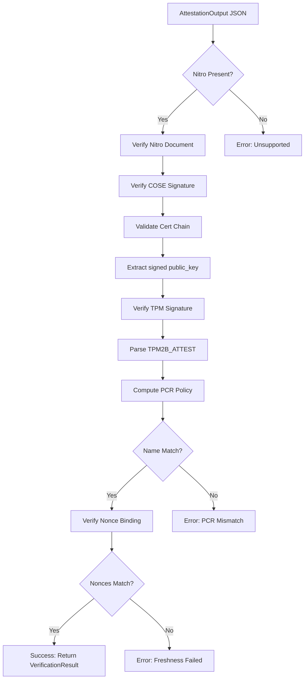

# vaportpm-verify

Verification library for TPM and Nitro attestations produced by `vaportpm-attest`.

## Overview

This crate verifies attestation documents without requiring TPM access. It can run anywhere - on a server, in a browser (via WASM), or in any environment that needs to verify attestations.

## Features

- **Nitro Attestation Verification** - COSE Sign1 signature and certificate chain validation
- **TPM Signature Verification** - ECDSA P-256 signature verification
- **PCR Policy Verification** - Compute and verify PCR policy digests
- **X.509 Chain Validation** - Certificate chain validation using rustls-webpki
- **Zero TPM Dependencies** - Pure cryptographic verification

## Usage

```rust
use vaportpm_verify::{verify_attestation_output, AttestationOutput, UnixTime};

fn verify(json: &str) -> Result<(), Box<dyn std::error::Error>> {
    // Parse the attestation output
    let output: AttestationOutput = serde_json::from_str(json)?;

    // Verify the entire attestation with current time
    let result = verify_attestation_output(&output, UnixTime::now())?;

    println!("Verified via: {:?}", result.method);
    println!("Nonce: {}", result.nonce);
    println!("Root CA hash: {}", result.root_pubkey_hash);

    Ok(())
}
```

## What Gets Verified

### Nitro Path (AWS)

| Check | Description |
|-------|-------------|
| COSE Signature | ECDSA P-384 signature over Nitro document |
| Certificate Chain | Validates chain, returns root pubkey hash |
| Public Key Binding | AK public key matches signed `public_key` field |
| TPM Signature | AK's ECDSA P-256 signature over TPM2B_ATTEST |
| PCR Policy | Certified name matches computed policy from SHA-384 PCRs |
| Nonce Binding | TPM nonce matches Nitro nonce (freshness) |
| PCR Values | Claimed PCRs match signed values in Nitro document |

### Verification Result

```rust
pub struct VerificationResult {
    /// The verified nonce (hex-encoded)
    pub nonce: String,
    /// SHA-256 hash of the root CA's public key
    pub root_pubkey_hash: String,
    /// How verification was performed
    pub method: VerificationMethod,
}
```

The `root_pubkey_hash` identifies the trust anchor. For AWS Nitro, this is the hash of the Nitro Root CA's public key.

## API

```rust
/// Verify a complete AttestationOutput, returns the root of trust hash
pub fn verify_attestation_output(
    output: &AttestationOutput,
    time: UnixTime,  // Use UnixTime::now() for production
) -> Result<VerificationResult, VerifyError>;

/// Convenience function that uses UnixTime::now()
pub fn verify_attestation_json(json: &str) -> Result<VerificationResult, VerifyError>;
```

The `time` parameter controls certificate validity checking. Use `UnixTime::now()` for production. For testing with fixtures that have expired certificates, pass a specific time from when the attestation was generated.

Returns `VerificationResult` containing:
- `nonce` - The verified challenge (hex)
- `root_pubkey_hash` - SHA-256 of the trust anchor's public key (hex)
- `method` - How verification was performed (currently only `Nitro`)

## Security Considerations

### Trust Model

This library is **trust-agnostic**. It verifies cryptographic signatures and returns the `root_pubkey_hash` - the SHA-256 hash of the root CA's public key. **You** decide whether to trust that root.

For AWS Nitro, you would check that `root_pubkey_hash` matches the known AWS Nitro Root CA public key hash.

### What You Must Verify Separately

1. **PCR Semantics** - This library verifies PCR *values*, not their *meaning*. You need to know what software produces which measurements.

2. **Nonce Freshness** - You must generate and track nonces to prevent replay attacks.

3. **Application Logic** - The attestation proves system state at a point in time. Your application must decide if that state is acceptable.

### Verification Flow

